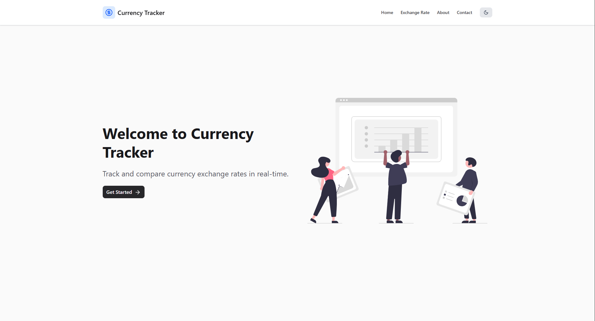

# 💱 Currency Tracker

A web application to **track historical currency exchange rates** between multiple global currencies with interactive charts and a modern UI.

## 🧩 Features

- 📈 View historical exchange rate data
- 🔄 Compare multiple currency pairs at once
- 📅 Select custom start and end dates
- 📊 Switch between line and bar chart views
- 💡 Light/Dark theme support
- 💻 Fully responsive & mobile-friendly UI

## 📷 Preview

 

## 🚀 Tech Stack

- **Frontend**: React (Vite), Tailwind CSS  
- **Icons**: Lucide React  
- **Charting**: Recharts  
- **Date API**: [Frankfurter API](https://www.frankfurter.app/)  
- **State Management**: React Hooks & Custom Hooks  
- **Theming**: Context API

## 🔧 Setup Instructions

### 1. Clone the repository

```bash
git clone https://github.com/your-username/currency-tracker.git
cd currency-tracker
